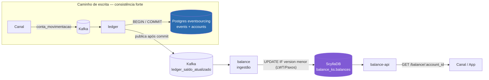

# ADR-0001 — Saldo Consultivo Eventualmente Consistente via ScyllaDB

| Campo | Valor |
|---|---|
| Status | **Accepted** (escopo clarificado em 2026-05-20, ver nota final — decisão original não revertida) |
| Data | 2026-02-05 |
| Relacionados | [RFC-001](../rfcs/RFC-001-api-simulacao-debito-credito.md), [ADR-0002](ADR-0002-api-consulta-saldo-transacional-ledger.md) |

## Contexto

Esta ADR formaliza, de forma retroativa, uma decisão já em produção na arquitetura do Ledger: o saldo exposto pela `balance-api` é um read model mantido no ScyllaDB, alimentado de forma assíncrona pelo serviço `balance` a partir do tópico Kafka `ledger_saldo_atualizado`, publicado pelo `ledger` somente após commit da transação no Postgres (`events` + `accounts`).

A ingestão usa `INSERT IF NOT EXISTS` e `UPDATE ... IF version < ?` (LWT — Lightweight Transactions / Paxos) para garantir que apenas versões mais recentes sobrescrevam o saldo, mesmo quando mensagens chegam fora de ordem pelo Kafka.

## Decisão

Manter o saldo consultivo como **eventualmente consistente**, otimizado para leitura barata e de baixa latência (timeout de 500ms na `balance-api`), servindo os casos de uso de consulta de saldo em app, dashboards e integrações que não tomam decisão financeira crítica no instante da leitura.

Aceita-se, conscientemente, uma janela de defasagem entre o commit no Postgres do Ledger (fonte da verdade) e a propagação para o Scylla — tipicamente sub-segundo, podendo chegar a alguns segundos sob pico de tráfego no Kafka.

## Diagrama de Arquitetura



A janela de defasagem aceita nesta ADR é o trecho entre o `COMMIT` no Postgres e a leitura em `balance-api` — todo o caminho à direita de `Ledger` no diagrama.

## Contratos e Payloads

**Evento Kafka `ledger_saldo_atualizado`** (produzido pelo `ledger`, consumido por `balance` ingestão):

```json
{
  "conta_id": "e424ed00-134e-4e92-92c1-40d57a7586c5",
  "balance": 1523.40,
  "version": 47,
  "timestamp": "2026-02-05T13:22:01Z"
}
```

**Linha no ScyllaDB** (`balance_ks.balances`): `id UUID PRIMARY KEY`, `balance DOUBLE`, `version INT` — atualizada apenas se `version` recebida > `version` armazenada.

**`GET /api/v1/balance/{account_id}`** (via Kong → `balance-api`):

```json
// 200 OK
{
  "id": "e424ed00-134e-4e92-92c1-40d57a7586c5",
  "balance": 1523.40
}
```
```json
// 404 Not Found
{ "error": "Account not found" }
```
```json
// 400 Bad Request
{ "error": "Invalid account ID format" }
```

SLA interno: timeout de 500ms na consulta ao ScyllaDB (`balanceLookupSLA`).

## Consequências

**Positivas:**
- Leitura de saldo em ScyllaDB é barata, previsível e não compete por recursos com o caminho de escrita do Ledger.
- LWT garante que o read model nunca regride para uma versão mais antiga, mesmo com reordenação de mensagens.

**Negativas / trade-offs aceitos:**
- Qualquer consumidor que exija saldo correto **no instante exato da leitura** (ex.: decisão de aprovar ou recusar uma operação financeira) não deve usar este read model. Este limite não estava explícito na decisão original — foi o que causou o Incidente #2026-118 quando o [RFC-001](../rfcs/RFC-001-api-simulacao-debito-credito.md) o violou implicitamente.

## Nota de atualização (2026-05-20)

Esta decisão **não foi revertida**. O saldo consultivo continua eventualmente consistente e continua sendo a fonte correta para os casos de uso originais. O que mudou é que o limite de uso, antes implícito, agora é explícito: casos que exigem consistência forte devem usar a capacidade descrita em [ADR-0002](ADR-0002-api-consulta-saldo-transacional-ledger.md), não este read model. Ver também o [Strategy Doc](../strategy/strategy-001-consistencia-apis-financeiras.md).
