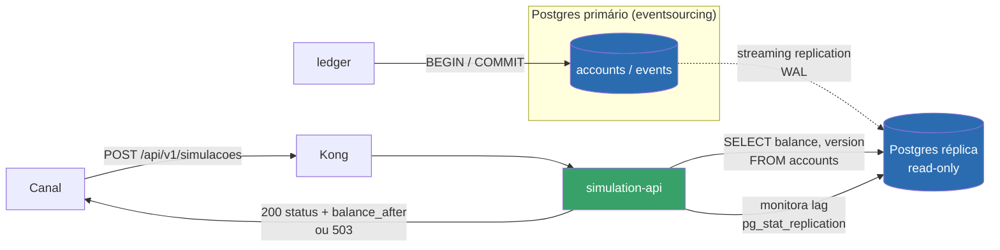

# ADR-0002 — Introduzir `simulation-api`: Leitura Transacional + Simulação de Débito/Crédito

| Campo | Valor |
|---|---|
| Status | **Accepted** (2026-05-12) — revisada em 2026-05-20 para absorver o [ADR-0005](ADR-0005-servico-simulacao-desacoplado.md) |
| Data | 2026-05-12 |
| Relacionados | [RFC-006](../rfcs/RFC-006-api-consulta-saldo-transacional.md), [ADR-0001](ADR-0001-saldo-consultivo-eventualmente-consistente.md), [ADR-0003](ADR-0003-rejeitar-consistencia-forte-scylladb.md), [ADR-0004](ADR-0004-rejeitar-simulacao-embarcada-ledger.md), [ADR-0005](ADR-0005-servico-simulacao-desacoplado.md) (merged nesta ADR) |

## Contexto

O [ADR-0003](ADR-0003-rejeitar-consistencia-forte-scylladb.md) e o [ADR-0004](ADR-0004-rejeitar-simulacao-embarcada-ledger.md) descartaram, respectivamente, resolver a necessidade de leitura fortemente consistente via ScyllaDB ou via endpoint embarcado no `ledger`. Restava uma lacuna real: nenhum componente do sistema oferecia, no mesmo instante, leitura síncrona e fortemente consistente do saldo transacional **e** a decisão de aprovar ou recusar um débito/crédito, sem competir por recursos com o caminho de escrita crítico.

## Decisão

Introduzir uma nova capacidade de plataforma: **`simulation-api`**, um serviço somente-leitura que consulta uma réplica de leitura PostgreSQL (streaming replication) do banco `eventsourcing` do Ledger, aplica a regra de simulação de débito/crédito sobre o saldo lido, e retorna o resultado (`aprovado`/`recusado` + `balance_after`) — com monitoramento de lag de replicação e postura fail-closed (recusa simular sobre dado acima de um limiar de lag configurado, em vez de arriscar aprovar com base em saldo desatualizado).

Detalhamento completo em [RFC-006](../rfcs/RFC-006-api-consulta-saldo-transacional.md).

## Diagrama de Arquitetura



`simulation-api` não compartilha processo, pool de conexões nem instância de banco com o `ledger` — lê exclusivamente da réplica, nunca do primário, e nunca escreve. Não há um segundo serviço entre o canal e a réplica: a leitura do saldo e a aplicação da regra de negócio acontecem no mesmo processo (ver "Revisão" abaixo).

## Contratos e Payloads

**`POST /api/v1/simulacoes/debito-credito`** (via Kong → `simulation-api`):

```json
// Request
{
  "conta_id": "e424ed00-134e-4e92-92c1-40d57a7586c5",
  "tipo": "debito",
  "valor": 250.00
}
```
```json
// 200 OK — aprovado
{
  "status": "aprovado",
  "saldo_atual": 500.00,
  "balance_after": 250.00
}
```
```json
// 200 OK — recusado
{
  "status": "recusado",
  "saldo_atual": 180.00,
  "balance_after": -70.00,
  "motivo_recusa": "saldo_insuficiente"
}
```
```json
// 503 Service Unavailable — lag de replicação acima do limiar configurado (padrão: 200ms)
{
  "error": "replica_lag_exceeded",
  "replica_lag_ms": 340,
  "threshold_ms": 200
}
```
```json
// 404 Not Found
{ "error": "account_not_found" }
```

Nenhum destes caminhos gera escrita: `simulation-api` nunca publica em `conta_movimentacao`, nunca persiste eventos, nunca altera `accounts`.

## Consequências

**Positivas:**
- Existe agora, no monorepo, uma fonte de leitura com contrato de consistência forte, explícita e isolada, sem reduzir a garantia de proteção do caminho de escrita do `ledger`.
- O padrão fail-closed elimina a classe de erro do Incidente #2026-118 (aprovar operação com base em dado desatualizado): na pior hipótese, o sistema recusa simular, nunca simula errado silenciosamente.
- Contrato de consistência de cada API fica explícito na topologia do sistema: quem quiser saldo rápido chama `balance-api`; quem quiser decisão financeira confiável chama `simulation-api`.
- Estabelece um precedente reutilizável: qualquer futuro caso de uso que precise de consistência forte sobre o estado do Ledger tem, a partir de agora, um caminho claro — não precisa reabrir a discussão de ScyllaDB vs. Postgres, nem a de onde colocar a regra de negócio.

**Negativas / custos aceitos:**
- Novo componente de infraestrutura (réplica de leitura Postgres) a operar, monitorar e manter atualizado com o primário.
- Novo serviço no monorepo com seu próprio ciclo de vida (deploy, observabilidade, on-call, rota Kong dedicada, rate limiting próprio).
- Duplicação potencial de regra de negócio (cálculo de `balance_after`) entre `ledger` e `simulation-api`, mitigada pela extração do pacote compartilhado `pkg/money` (ver [RFC-006](../rfcs/RFC-006-api-consulta-saldo-transacional.md)).
- Consumidores desta API devem estar preparados para tratar `503` como resposta legítima e esperada (lag acima do limiar), não como falha a ser mascarada com retry agressivo ou fallback para o saldo consultivo.

## Escopo

Este serviço não substitui a `balance-api`/ScyllaDB. Ambos coexistem, cada um com seu contrato de consistência documentado — ver [ADR-0001](ADR-0001-saldo-consultivo-eventualmente-consistente.md) e o [Strategy Doc](../strategy/strategy-001-consistencia-apis-financeiras.md).

## Revisão (2026-05-20) — absorção do ADR-0005

O desenho original aceito por esta ADR previa um serviço somente-leitura (`ledger-query-api`) consumido por um segundo serviço de orquestração, decidido separadamente no [ADR-0005](ADR-0005-servico-simulacao-desacoplado.md) (`simulation-api`). Na revisão final antes do rollout, essa cadeia de dois serviços foi considerada indireção desnecessária para aplicar uma regra de negócio simples, e os dois serviços foram fundidos em um único `simulation-api`, que já nasce lendo a réplica e aplicando a regra de simulação — sem alterar nenhum dos princípios decididos aqui ou no ADR-0005 (isolamento do caminho de escrita, fail-closed, serviço dedicado e não embarcado na `balance-api`). O [ADR-0005](ADR-0005-servico-simulacao-desacoplado.md) permanece publicado, marcado como *Merged*, como registro do racional original de manter simulação desacoplada.
