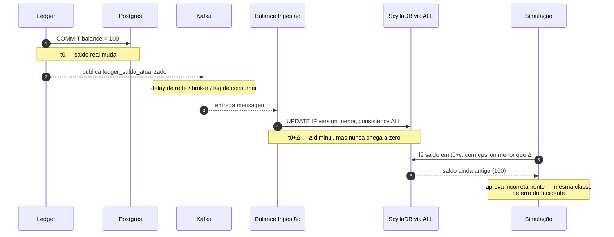

# ADR-0003 — Rejeitar Consistência Forte no ScyllaDB como Solução para Simulação

| Campo | Valor |
|---|---|
| Status | **Rejected** (decisão de não fazer, registrada em 2026-05-06) |
| Data | 2026-05-06 |
| Relacionados | [RFC-003](../rfcs/RFC-003-consistencia-forte-scylladb.md), [ADR-0001](ADR-0001-saldo-consultivo-eventualmente-consistente.md) |

## Contexto

Após o Incidente #2026-118 (ver [RFC-002](../rfcs/RFC-002-inconsistencia-saldo-consultivo-simulacoes.md)), foi avaliado se o problema de simulações incorretas poderia ser resolvido elevando o nível de consistência de leitura/escrita do ScyllaDB (`LOCAL_QUORUM`/`ALL`) e reduzindo o lag do consumer de ingestão (`balance-ingestion-group`). Detalhamento completo em [RFC-003](../rfcs/RFC-003-consistencia-forte-scylladb.md).

## Decisão

**Não** elevar a consistência do ScyllaDB, e **não** tratar redução de lag do pipeline Kafka → Scylla como solução para o problema de simulação.

## Racional

A defasagem entre o Postgres do Ledger (fonte da verdade) e o ScyllaDB é estrutural: existe entre o commit da transação no Ledger e a entrega/consumo da mensagem em `ledger_saldo_atualizado`, independente de quão rápido o consumer processa ou de qual nível de consistência o Scylla usa internamente. Reduzir essa janela apenas torna o caso de corrida mais raro, não o elimina — o que é inaceitável para uma decisão financeira binária (aprovar/recusar). Além disso, elevar consistência de escrita para `ALL` no Scylla tem custo de latência e disponibilidade (Paxos) que penalizaria todos os consumidores do saldo consultivo, não apenas o caso de simulação.

## Diagrama de Arquitetura (proposta avaliada e por que a janela permanece)

Mesmo com `consistency=ALL` na escrita, o caminho `Ledger → Kafka → Balance Ingestão → Scylla` continua existindo — o diagrama acima é idêntico ao de [ADR-0001](ADR-0001-saldo-consultivo-eventualmente-consistente.md), apenas com um Δ menor. É por isso que esta proposta foi rejeitada: reduz a janela, não a fecha.

## Consequências

- O saldo consultivo permanece com a configuração atual (ver [ADR-0001](ADR-0001-saldo-consultivo-eventualmente-consistente.md)), sem mudanças.
- A necessidade de consistência forte para simulação é resolvida por uma fonte de dados diferente — ver [ADR-0002](ADR-0002-api-consulta-saldo-transacional-ledger.md).
- Esta ADR existe para que a mesma proposta não seja reavaliada no futuro sem o contexto de por que foi descartada.
