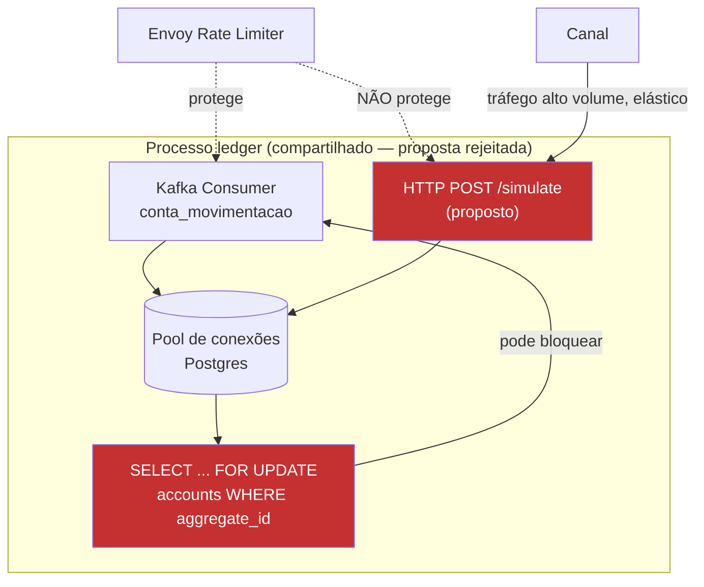

# ADR-0004 — Rejeitar Simulação Embarcada no Processo do Ledger

| Campo | Valor |
|---|---|
| Status | **Rejected** (decisão de não fazer, registrada em 2026-05-08) |
| Data | 2026-05-08 |
| Relacionados | [RFC-004](../rfcs/RFC-004-simulacao-sincrona-embarcada-ledger.md), [ADR-0002](ADR-0002-api-consulta-saldo-transacional-ledger.md) |

## Contexto

Avaliou-se expor um endpoint HTTP síncrono diretamente no serviço `ledger` para servir simulações, lendo `accounts.balance` na mesma transação/pool usada pelo processamento de `conta_criada`/`conta_movimentacao`. Detalhamento completo em [RFC-004](../rfcs/RFC-004-simulacao-sincrona-embarcada-ledger.md).

## Decisão

**Não** adicionar nenhuma rota HTTP de domínio ao serviço `ledger`. O `ledger` permanece exclusivamente um consumidor de comandos Kafka (`conta_criada`, `conta_movimentacao`) e publicador de eventos de confirmação — nunca um servidor de leituras síncronas para consumidores externos.

## Racional

O `ledger` é o componente mais protegido do sistema — é o único caminho de escrita para o Event Store, e já possui rate limiting dedicado (Envoy, via `ledger/pkg/envoyratelimit`) especificamente para se defender de picos de tráfego, como o observado no Incidente #2026-118. Qualquer tráfego de leitura de alto volume e alta elasticidade (simulação tende a gerar mais chamadas que confirmações reais) compartilhando processo, pool de conexões Postgres ou CPU com esse caminho crítico aumenta o raio de impacto de qualquer degradação: um problema em simulação passaria a poder comprometer a capacidade do sistema de registrar transações reais.

## Diagrama de Arquitetura (proposta avaliada)

O ponto vermelho no diagrama é a origem da rejeição: `SimEndpoint` compartilha pool de conexões e pode reter lock de linha (`FOR UPDATE`) sobre a mesma conta que o `KafkaConsumer` precisa movimentar, e não é coberto pelo rate limiting que protege o caminho de escrita.

## Consequências

- Necessidade de consistência forte para simulação é resolvida por um serviço desacoplado, lendo de uma réplica de leitura do Postgres — ver [ADR-0002](ADR-0002-api-consulta-saldo-transacional-ledger.md).
- Reforça, como princípio de arquitetura para o monorepo, que serviços de escrita crítica não devem acumular responsabilidade de servir leitura de alto volume para consumidores externos — consolidado no [Strategy Doc](../strategy/strategy-001-consistencia-apis-financeiras.md).
