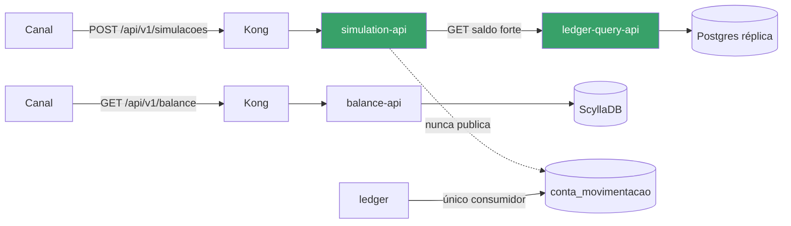

# ADR-0005 — Simulação como Serviço Desacoplado (`simulation-api`)

| Campo | Valor |
|---|---|
| Status | **Merged** em [ADR-0002](ADR-0002-api-consulta-saldo-transacional-ledger.md) (2026-05-20) — ver "Nota de fusão" ao final |
| Data | 2026-05-20 |
| Relacionados | [RFC-007](../rfcs/RFC-007-api-simulacao-debito-credito-v2.md), [RFC-001](../rfcs/RFC-001-api-simulacao-debito-credito.md) (superseded), [ADR-0002](ADR-0002-api-consulta-saldo-transacional-ledger.md) (absorveu esta ADR) |

> **Nota:** esta ADR está preservada como registro histórico da decisão original de dois serviços em cadeia (`ledger-query-api` + `simulation-api`). A decisão efetivamente vigente está em [ADR-0002](ADR-0002-api-consulta-saldo-transacional-ledger.md), que absorveu esta ADR — ver "Nota de fusão" ao final deste documento.

## Contexto

Com a existência do `ledger-query-api` ([ADR-0002](ADR-0002-api-consulta-saldo-transacional-ledger.md)), era necessário decidir onde reimplementar a simulação de débito/crédito: de volta na `balance-api` (como no RFC-001 original, agora apontando para a nova fonte de dados) ou em um serviço novo e dedicado.

## Decisão

Criar um serviço novo, **`simulation-api`**, com a única responsabilidade de simular movimentações financeiras sem efetivá-las, consumindo `ledger-query-api` como fonte de saldo. O endpoint `POST /balance/simulate` da `balance-api` (introduzido no RFC-001) é removido.

## Racional

Colocar simulação na `balance-api` mantém a ambiguidade que causou o Incidente #2026-118: um mesmo serviço passaria a responder tanto por "consulta de saldo eventualmente consistente" quanto por "decisão financeira que exige consistência forte", com o risco real de que uma manutenção futura reconecte, por engano ou por conveniência, a simulação de volta ao ScyllaDB (por exemplo, para "reaproveitar código"). Um serviço com um único propósito e uma única fonte de dados torna esse erro estruturalmente mais difícil de cometer — a dependência em `ledger-query-api` é a única forma de o serviço responder a uma simulação.

Adicionalmente, times de simulação e de consulta de saldo têm ritmos de mudança diferentes (regras de negócio de aprovação evoluem com o produto de canais; o saldo consultivo evolui com necessidades de leitura em escala) — serviços separados evitam que uma mudança em um domínio force deploy ou revisão do outro.

## Diagrama de Arquitetura



`simulation-api` só tem uma dependência de dado (`ledger-query-api`) e nenhuma dependência de escrita — não publica em `conta_movimentacao`, não persiste eventos, não é alcançável a partir do `ledger`.

## Contratos e Payloads

**`POST /api/v1/simulacoes/debito-credito`** (via Kong → `simulation-api`):

```json
// Request
{
  "conta_id": "e424ed00-134e-4e92-92c1-40d57a7586c5",
  "tipo": "debito",
  "valor": 250.00
}
```
```json
// 200 OK — aprovada
{
  "aprovado": true,
  "saldo_atual": 500.00,
  "saldo_projetado": 250.00
}
```
```json
// 200 OK — recusada
{
  "aprovado": false,
  "saldo_atual": 180.00,
  "saldo_projetado": -70.00,
  "motivo_recusa": "saldo_insuficiente"
}
```
```json
// 503 Service Unavailable — fail-closed (ledger-query-api indisponível ou lag acima do limiar)
{
  "error": "saldo_indisponivel",
  "detalhe": "ledger-query-api retornou 503 (replica_lag_exceeded)"
}
```

## Consequências

**Positivas:**
- Contrato de consistência de cada API fica explícito na topologia do sistema, não apenas em documentação: quem quiser saldo rápido chama `balance-api`; quem quiser decisão financeira confiável chama `simulation-api`.
- Superfície de falha isolada: uma degradação em `simulation-api` (ou em `ledger-query-api`) não afeta a consulta de saldo do app nem o processamento de movimentações do `ledger`.
- Reforça, junto com [ADR-0004](ADR-0004-rejeitar-simulacao-embarcada-ledger.md), o princípio de que capacidades com contratos de consistência diferentes não devem compartilhar processo nem API.

**Negativas / custos aceitos:**
- Mais um serviço a operar no monorepo (deploy, observabilidade, rota Kong dedicada, rate limiting próprio).
- Duplicação potencial de regra de negócio (cálculo de saldo projetado) entre `ledger` e `simulation-api`, mitigada pela extração do pacote compartilhado `pkg/money` definida no [RFC-007](../rfcs/RFC-007-api-simulacao-debito-credito-v2.md).

## Nota

Esta ADR formaliza a razão de a [RFC-001](../rfcs/RFC-001-api-simulacao-debito-credito.md) estar marcada como *superseded*: não porque simular sobre saldo consultivo fosse uma ideia sem valor, mas porque a implementação original não deixava claro — nem para quem a consumia, nem para quem a mantinha — que estava operando sob um contrato de consistência incompatível com o uso que dela se fazia.

## Nota de fusão (2026-05-20)

Na revisão final antes do rollout, a divisão entre `ledger-query-api` (leitura pura de saldo, decidida no ADR-0002 original) e este `simulation-api` (orquestração + regra de negócio) foi considerada indireção desnecessária: um segundo hop de rede síncrono para aplicar uma regra trivial, sem outro consumidor real ou planejado para a leitura pura de saldo. Esta ADR foi **fundida** no [ADR-0002](ADR-0002-api-consulta-saldo-transacional-ledger.md) (revisado na mesma data), que passou a registrar diretamente a decisão de ter um único `simulation-api`, lendo a réplica e aplicando a regra de simulação no mesmo processo. Todo o racional acima — serviço dedicado, não embarcado na `balance-api`, contratos de consistência explícitos na topologia — permanece válido; apenas o número de serviços em cadeia mudou.
