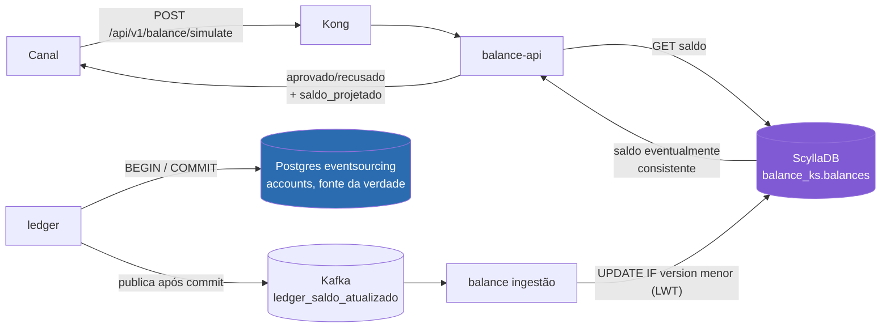
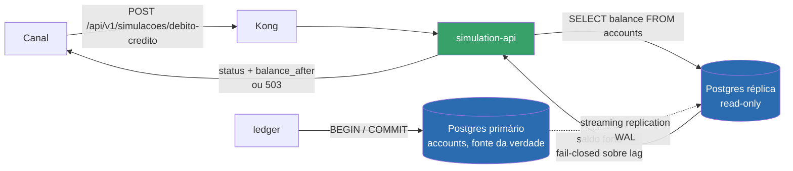

# RFC-001 — API de Simulação de Débito/Crédito

| Campo | Valor |
|---|---|
| Status | **Superseded** (por [RFC-007](RFC-007-api-simulacao-debito-credito-v2.md), em 2026-05-20) |
| Autor | Squad Ledger |
| Data | 2026-02-03 |
| Revisores | Squad Canais de Pagamento, Squad Plataforma de Dados |
| Relacionados | [ADR-0001](../adrs/ADR-0001-saldo-consultivo-eventualmente-consistente.md) |

## Contexto

Os canais que iniciam débitos e créditos contra uma conta (app, internet banking, integrações de parceiros) hoje só descobrem se uma movimentação será aceita **depois** de publicá-la no tópico `conta_movimentacao` e aguardar o resultado assíncrono (`ledger_nova_transacao_confirmada` / `ledger_saldo_atualizado`). Isso é ruim para UX: o canal precisa poder perguntar, antes de comprometer a operação, "esse débito de R$ X vai passar, e qual vai ser o saldo depois?"

Já existe hoje uma API de consulta de saldo (`balance-api`), que serve `GET /balance/:account_id` lendo o read model de saldo no ScyllaDB (keyspace `balance_ks`, tabela `balances`), alimentado de forma assíncrona pelo serviço `balance` a partir do tópico `ledger_saldo_atualizado`. Essa API já é exposta publicamente via Kong (`/api/v1/balance`).

## Proposta

Adicionar um novo endpoint `POST /api/v1/balance/simulate` na `balance-api`, que:

1. Recebe `{ account_id, tipo (debito|credito), valor }`.
2. Consulta o saldo atual no ScyllaDB (mesmo client já usado por `GetBalance`).
3. Calcula `saldo_projetado = saldo_atual ± valor`.
4. Retorna `{ aprovado: bool, saldo_atual, saldo_projetado, motivo_recusa? }`, recusando quando `saldo_projetado < 0`.

Nenhuma escrita é realizada — a simulação é somente leitura e não gera eventos, não passa pelo Ledger nem pelo tópico `conta_movimentacao`.

### Diagrama — Fluxo proposto nesta RFC

O ponto crítico deste desenho, não percebido no momento da aprovação: o caminho de simulação (`Channel → Kong → balance-api → Scylla`) nunca toca o Postgres do Ledger diretamente. Ele depende de o caminho assíncrono inferior (`Ledger → Kafka → balance ingestão → Scylla`) já ter propagado o saldo mais recente — o que só é garantido eventualmente, não no instante da simulação.

### Por que reusar a Balance API

- Menor esforço: reaproveita client Scylla, observabilidade (`BusinessLookupsTotal`) e rota já existente em Kong.
- O saldo consultivo já é descrito no README do projeto como "read model para consultas rápidas" — o entendimento inicial da squad é que ele é adequado para qualquer leitura, incluindo simulação.

## Alternativas consideradas

- Consultar diretamente o Postgres do Ledger (`accounts.balance`) — descartada nesta rodada por exigir expor uma nova via de acesso ao banco transacional do Ledger, considerado fora de escopo para uma necessidade que parecia ser "só mais uma leitura de saldo".

## Impacto

- Novo endpoint em `balance-api`, sem mudança em `ledger`, `balance` (ingestão) ou schema do ScyllaDB.
- Sem impacto no caminho de escrita transacional.

## Plano de rollout

1. Implementar `POST /balance/simulate` na `balance-api`.
2. Expor via Kong reaproveitando o service `balance-service` existente.
3. Rollout direto para os canais consumidores, sem feature flag — endpoint é read-only e de baixo risco percebido.

## Métricas de sucesso

- Latência p99 do endpoint de simulação < 200ms (mesma SLA de `GetBalance`, hoje 500ms de timeout).
- Taxa de simulações "aprovadas" que depois falham na movimentação real (`conta_movimentacao` recusada por saldo insuficiente) — meta inicial: sem meta definida, sem baseline histórico.

## Nota de encerramento (adicionada em 2026-05-20)

Esta RFC foi **superseded** pelo [RFC-006](RFC-006-api-consulta-saldo-transacional.md) após o Incidente #2026-118 (ver [RFC-002](RFC-002-inconsistencia-saldo-consultivo-simulacoes.md)), que demonstrou que a métrica de sucesso acima — não definida no momento da aprovação — era exatamente o ponto cego desta proposta. O endpoint `POST /balance/simulate` descrito aqui foi descontinuado em favor do `simulation-api` entregue pelo RFC-006, que consulta uma réplica transacional do Ledger em vez do saldo consultivo do ScyllaDB. (O RFC-007 propôs originalmente essa simulação como um segundo serviço separado; foi fundido no RFC-006 em 2026-05-20 — ver nota de fusão no próprio RFC-007.)

### Diagrama — Novo fluxo proposto (RFC-006, `simulation-api`)

A diferença estrutural em relação ao diagrama anterior: `simulation-api` lê de uma réplica do **mesmo** banco que o `ledger` escreve (streaming replication, lag sub-100ms e mensurável), nunca de um read model alimentado por Kafka. Quando o lag da réplica ultrapassa o limiar aceitável, a API recusa responder (`503`) em vez de simular sobre dado potencialmente desatualizado — ver [ADR-0002](../adrs/ADR-0002-api-consulta-saldo-transacional-ledger.md).
